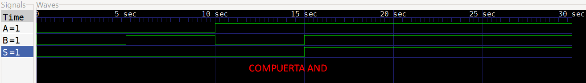
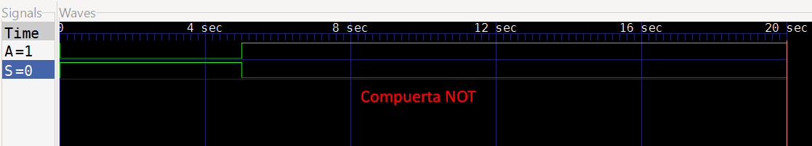
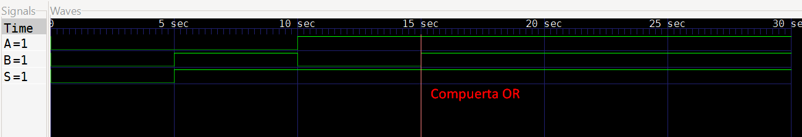
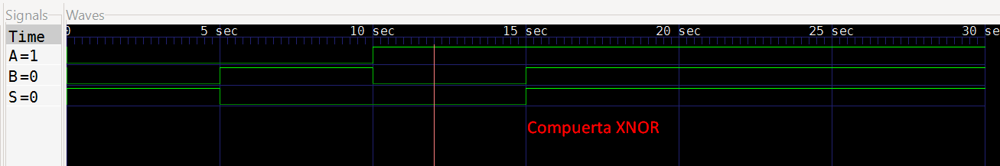
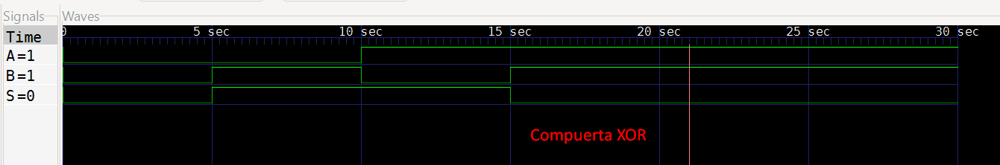
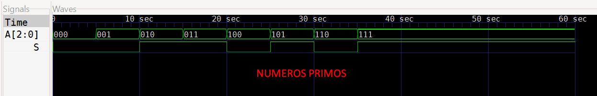
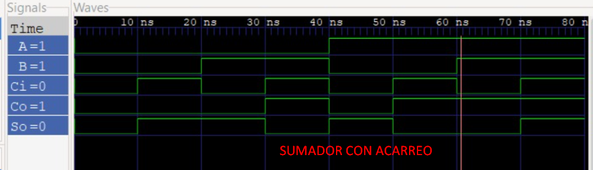

        
# Lab01 - Sumador/Restador de 4 bits

# Integrantes
    * [Cristian Santiago Alfonso Valderrama]
    (https://github.com/CristianAlfonso-ecci) 
    * [Fredi Alexander Melo Prada]
    (https://github.com/Fredi-melo-ecci) 
    * [Fabiam Acevedo]
    (https://github.com/Fabiam-Acevedo-ECCI) 

# Informe

Indice:

1. [Compuertas](#documentación-de-los-circuitos-implementados-implementado)
2. [Verificador de números primos](#simulaciones)
3. [Sumador con acarreo](#evidencias-de-implementación)
4. [Implementación en FPGA](#preguntas)
5. [Resultados](#conclusiones)
6. [Conclusiones](#conclusiones)
7. [Referencias](#referencias)

## Documentación del diseño implementado
En esta práctica se diseñaron circuitos de lógica combinacional en Verilog, a partir del análisis de tablas de verdad y de las expresiones booleanas asociadas.

Desarrollo de la práctica
Primero se modelaron las compuertas básicas NOT, AND, OR, XOR y XNOR, y se validó su funcionamiento mediante simulación.

Luego se diseñó un circuito combinacional que detecta números primos codificados en 3 bits, evaluando todas las combinaciones posibles de entrada.

Por último, se implementó un sumador completo de 1 bit con entradas A, 𝐵 y 𝐶in, y salidas de suma S y acarreo Cout.

Todos los módulos fueron simulados para verificar su correcto comportamiento lógico y, posteriormente, se sintetizaron e implementaron en una FPGA usando Quartus, comprobando su operación en hardware.
### 1. Compuertas

#### 1.1 Compuerta AND
La compuerta AND produce un `1` únicamente cuando todas sus entradas son `1`.

| A | B | S |
| - | - | - |
| 0 | 0 | 0 |
| 0 | 1 | 0 |
| 1 | 0 | 0 |
| 1 | 1 | 1 |

Codificación en código Verilog:

```verilog
module and_gate(
    input A,
    input B,
    output S
);

and (S, A, B);

endmodule
```

#### 1.2 Compuerta NOT

La compuerta NOT tiene una entrada y una salida. Su función es invertir el valor lógico de la entrada; en el ejercicicio se nego la entrada A.

| A | S |
| - | - |
| 0 | 1 |
| 1 | 0 |

Codificación en código Verilog:

```verilog
module not_gate(
    input A,
    output S
);

not (S, A);

endmodule
```

### 1.3. Compuerta OR

La compuerta OR produce un `1` cuando al menos una de sus entradas es `1`.

| A | B | S |
| - | - | - |
| 0 | 0 | 0 |
| 0 | 1 | 1 |
| 1 | 0 | 1 |
| 1 | 1 | 1 |

Codificación en código Verilog:

```verilog
module or_gate(
    input A,
    input B,
    output S
);

or (S, A, B);

endmodule
```

### 1.4. Compuerta XOR

La compuerta XOR produce un `1` cuando sus entradas son diferentes.

| A | B | S |
| - | - | - |
| 0 | 0 | 0 |
| 0 | 1 | 1 |
| 1 | 0 | 1 |
| 1 | 1 | 0 |

Codificación en código Verilog:

```verilog
module xor_gate(
    input A,
    input B,
    output S
);

xor (S, A, B);

endmodule
```

### 1.5. Compuerta XNOR

La compuerta XNOR produce un `1` cuando sus entradas son iguales.

| A | B | S |
| - | - | - |
| 0 | 0 | 1 |
| 0 | 1 | 0 |
| 1 | 0 | 0 |
| 1 | 1 | 1 |

Codificación en código Verilog:

```verilog
module xnor_gate(
    input A,
    input B,
    output S
);

xnor (S, A, B);

endmodule
```

### Evidencia de simulación

Las tablas de verdad fueron verificadas mediante simulación ejecutando GTKWAVE (Verilog) de los respectivos módulos.    






---

## 2. Verificador de números primos     

Se diseñó un circuito combinacional capaz de determinar si un número binario de tres bits corresponde a un número primo.

Los números representables con tres bits son:

| A | B | C | Decimal | Primo |
| - | - | - | ------: | ----- |
| 0 | 0 | 0 |       0 | 0     |
| 0 | 0 | 1 |       1 | 0     |
| 0 | 1 | 0 |       2 | 1     |
| 0 | 1 | 1 |       3 | 1     |
| 1 | 0 | 0 |       4 | 0     |
| 1 | 0 | 1 |       5 | 1     |
| 1 | 1 | 0 |       6 | 0     |
| 1 | 1 | 1 |       7 | 1     |

Por lo tanto, la salida debe activarse para los valores 2, 3, 5 y 7.

La función lógica implementada fue:

```text
P = (~A & B) | (~A & C) | (B & C)
```

Codificación en código Verilog:

```verilog
module primos(
    input [2:0] A,
    output S
);

//BOOLEANA: S = ~AB + AC
assign S = (~A[2]&A[1])|(A[2]&A[0]);
endmodule
```

### Evidencia de simulación

El funcionamiento del detector de números primos fue comprobado mediante simulación, verificando los ocho posibles valores de entrada.



## 3. Sumador con acarreo

Un sumador completo de un bit posee tres entradas:

* `A`: primer bit de entrada.
* `B`: segundo bit de entrada.
* `Cin`: acarreo de entrada.

Y dos salidas:

* `S`: resultado de la suma.
* `Cout`: acarreo de salida.

### Tabla de verdad

| A | B | Cin | Cout | S |
| - | - | --- | ---- | - |
| 0 | 0 | 0   | 0    | 0 |
| 0 | 0 | 1   | 0    | 1 |
| 0 | 1 | 0   | 0    | 1 |
| 0 | 1 | 1   | 1    | 0 |
| 1 | 0 | 0   | 0    | 1 |
| 1 | 0 | 1   | 1    | 0 |
| 1 | 1 | 0   | 1    | 0 |
| 1 | 1 | 1   | 1    | 1 |

Las expresiones utilizadas fueron:

```text
S = Ci ^ ( A ^ B);
Co = ( B & Ci ) | A & ( B | Ci);
```

Implementación en Verilog:

```verilog
module sumador(
    
    input A,
    input B,
    input Ci,

    output S,
    output Co

);

assign S = Ci ^ ( A ^ B);
assign Co = ( B & Ci ) | A & ( B | Ci);

endmodule
```

### Evidencia de simulación

El sumador completo fue verificado mediante simulación para las ocho combinaciones posibles de sus entradas.


---

# 4. Implementación en FPGA

Tras validar los diseños mediante simulación, los circuitos se implementaron en una tarjeta FPGA empleando el entorno de desarrollo Quartus. Para la asignación correcta de pines, se consultó el manual de la placa con FPGA Altera MAX 10 (10M50DAF484C7G), configurando los switches como entradas (señales A, B y C) y los LEDs como salidas.

Esta implementación en hardware permitió verificar físicamente el correcto funcionamiento de las compuertas lógicas, del detector de números primos y del sumador.

### Evidencias de implementación

En esta sección se incorporan las evidencias obtenidas durante la implementación y demostración del funcionamiento de los circuitos en FPGA.

[Ver implementación de las Compuertas lógicas en FPGA](https://youtu.be/MM3MyO3RRKw?si=GQfy_rpKzAkGBrPl)

[Ver implementación de Números Primos en FPGA](https://youtu.be/nTzB3nlsrXE?si=l7XFbt7ubSY0wZQI)

[Ver implementación de Sumador de bit con acarreo Primos en FPGA](https://youtu.be/GsIWBzj9ANs?si=Bp2-Y4NsRiLd-1NU)

---


# 5. Resultados

A partir de las simulaciones realizadas, se verificó que los circuitos diseñados exhiben el comportamiento esperado según sus respectivas tablas de verdad.

Las compuertas lógicas NOT, AND, OR, XOR y XNOR respondieron de manera correcta para todas las combinaciones de entrada evaluadas.

El detector de números primos identificó adecuadamente los valores 2, 3, 5 y 7 dentro del rango de números representables con tres bits.

Por su parte, el sumador generó correctamente tanto la salida de suma como el acarreo y las dos salidas correspondiente en lops leds de la tarjeta FPGA para las ocho combinaciones posibles de sus entradas.

La implementación en FPGA permitió validar el funcionamiento de los diseños más allá del entorno de simulación, estableciendo una correspondencia directa entre la descripción en HDL y su operación en hardware..

---
## 6. Conclusiones
* Se reforzaron los conceptos fundamentales de lógica combinacional y el funcionamiento de las compuertas lógicas básicas (NOT, AND, OR, XOR y XNOR).

* Se aprendió a describir circuitos digitales en Verilog, empleando primitivas y descripciones estructurales para modelar hardware destinado a implementación en FPGA.

* Se evidenció la importancia de las tablas de verdad y de los métodos de reducción booleana para obtener las ecuaciones de salida que permiten verificar el comportamiento esperado de un circuito combinacional.

* Se diseñó e implementó un circuito capaz de detectar números primos (2, 3, 5 y 7) representados mediante tres bits.

* Se comprendió el funcionamiento de un sumador completo de 1 bit con acarreo, visualizando la relación entre el resultado de la suma y la señal de acarreo de salida.

La implementación en FPGA permitió validar experimentalmente los diseños desarrollados y establecer una correspondencia directa entre la simulación y el comportamiento real del hardware.


---
# 7. Referencias

* Material de clase de la asignatura Técnicas Digitales, Universidad ECCI.
* Documentación y material proporcionado para el Laboratorio 01: Introducción a lógica combinacional.
* IEEE Standard for Verilog Hardware Description Language.
* Manual de usuario DE10-Lite Cost-effective Max 10 board
