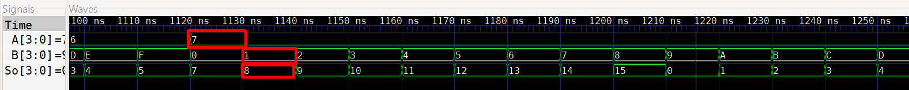
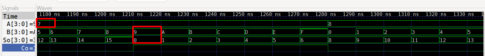
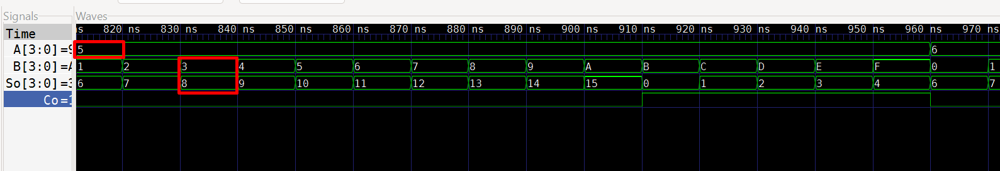

# Lab02 - Sumador de 4 bits

## Integrantes

    * [Cristian Santiago Alfonso Valderrama]
    (https://github.com/CristianAlfonso-ecci) 
    * [Fredi Alexander Melo Prada]
    (https://github.com/Fredi-melo-ecci) 
    * [Fabiam Acevedo]
    (https://github.com/Fabiam-Acevedo-ECCI) 

## Informe

Indice:

1. [Sumador de 4 bit](#1-sumador-de-4-bit)
2. [Simulaciones](#2-simulaciones)
3. [Implementación en FPGA](#3-implementación-en-fpga)
4. [Resultados](#4-resultados)
5. [Conclusiones](#5-conclusiones)
6. [Referencias](#6-referencias)

## Documentación del diseño implementado

En esta práctica se diseñaron circuitos de lógica combinacional en Verilog, a partir del análisis de tablas de verdad y de las expresiones booleanas asociadas.

Desarrollo de la práctica
Se implementó como base el sumador completo de 1 bit realizado en la anterior práctica de labratorio, este sumador de un bit con entradas A, 𝐵 y 𝐶in, y salidas de suma S y acarreo Cout.

Un sumador completo de un bit posee tres entradas:

* `A`: primer bit de entrada.
* `B`: segundo bit de entrada.
* `Cin`: acarreo de entrada.

Y dos salidas:

* `S`: resultado de la suma.
* `Cout`: acarreo de salida.

### Tabla de verdad

| A | B | Cin | Cout | S |
| - | - | --- | ---- | - |
| 0 | 0 | 0   | 0    | 0 |
| 0 | 0 | 1   | 0    | 1 |
| 0 | 1 | 0   | 0    | 1 |
| 0 | 1 | 1   | 1    | 0 |
| 1 | 0 | 0   | 0    | 1 |
| 1 | 0 | 1   | 1    | 0 |
| 1 | 1 | 0   | 1    | 0 |
| 1 | 1 | 1   | 1    | 1 |

Las expresiones utilizadas fueron:

    S = Ci ^ ( A ^ B);
    Co = ( B & Ci ) | A & ( B | Ci);

Todos los módulos fueron simulados para verificar su correcto comportamiento lógico y, posteriormente, se sintetizaron e implementaron en una FPGA usando Quartus, comprobando su operación en hardware.

## 1. Sumador de 4 bit

### 1.1 Descripción del sumador de 4 bits en Verilog

El código presentado corresponde a un sumador binario de 4 bits implementado en Verilog. Su función consiste en sumar dos operandos binarios de 4 bits, denominados \(A\) y \(B\), y generar como resultado una salida de suma de 4 bits \(SO\) junto con un bit de acarreo de salida \(CO\).

El módulo principal bajo prueba es `sumadorfour.v`, al cual se conectan las siguientes señales:

* \(A[3:0]\): primer número binario de 4 bits.  
* \(B[3:0]\): segundo número binario de 4 bits.  
* \(CI\): acarreo de entrada.  
* \(SO[3:0]\): resultado de la suma.  
* \(CO\): acarreo de salida.  

El banco de pruebas (`tb_sumadorfour.v`) emplea dos ciclos `for` el primero se demonino con una variable `i` y el segundo con una variable `j` para recorrer de manera automática todas las combinaciones posibles de los operandos \(A\) y \(B\), desde \(0000\) hasta \(1111\). Tras asignar cada combinación de entradas, se introduce un retardo de 10 ns mediante `#10`, lo cual permite observar y verificar el comportamiento del sumador para cada caso.

### Evidencias de simulación

Las tablas de verdad fueron verificadas mediante simulación ejecutando GTKWAVE (Verilog) de los respectivos módulos.

---
Codificación en código Verilog:

```verilog
`include "sumador.v" // llamada al módulo sumador de un bit

module sum_4bit (
    input  wire [3:0] A,
    input  wire [3:0] B,
    input  wire       Ci,
    output wire [3:0] So,
    output wire       Co
);
    wire c0, c1, c2;  

    sumador bit0 (
        .A  (A[0]),
        .B  (B[0]),
        .Ci (Ci),
        .So (So[0]),
        .Co (c0)       
    );

    sumador bit1 (
        .A  (A[1]),
        .B  (B[1]),
        .Ci (c0),
        .So (So[1]),
        .Co (c1)      
    );

    sumador bit2 (
        .A  (A[2]),
        .B  (B[2]),
        .Ci (c1),
        .So (So[2]),
        .Co (c2)      
    );

    sumador bit3 (
        .A  (A[3]),
        .B  (B[3]),
        .Ci (c2),
        .So (So[3]),
        .Co (Co)      
    );

endmodule
```

Codificación en código Verilog tb_sumadorfour:

```verilog
// tb_sumadorfour.v
`include "sumadorfour.v"
`timescale 1ns/1ps

module tb_sumadorfour;

    reg  [3:0] A, B;
    reg        Ci;
    wire [3:0] So;
    wire       Co;

    integer i, j;

    sum_4bit uut (
        .A  (A),
        .B  (B),
        .Ci (Ci),
        .So (So),
        .Co (Co)
    );

    initial begin
        $dumpfile("tb_sumadorfour.vcd");
        $dumpvars(0, tb_sumadorfour);
     // ciclos de prueba for   
        Ci = 0;
        for (i = 0; i < 16; i = i + 1) begin
            for (j = 0; j < 16; j = j + 1) begin
                    A = i;
                    B = j;
                    #10;
            end
        end
        $finish;
    end

endmodule
```

---

## Funcionamiento del sumador de 4 bits

El funcionamiento del circuito se basa en cuatro etapas conectadas de manera secuencial, donde cada etapa corresponde a un sumador completo de 1 bit.

El primer sumador procesa los bits menos significativos `A[0]` y `B[0]`, junto con el acarreo de entrada `Ci`. El acarreo generado por esta primera etapa se conecta como entrada de acarreo al segundo sumador.

El segundo sumador procesa `A[1]` y `B[1]` y recibe el acarreo proveniente de la etapa anterior. Este proceso se repite de forma cascada hasta llegar al cuarto sumador, que opera sobre los bits más significativos `A[3]` y `B[3]`.

El último módulo genera el bit de suma `So[3]` y el acarreo final `Co`, completando así la operación de suma de los dos números binarios de 4 bits. Esta conexión en cascada permite realizar la suma completa de manera correcta para cualquier combinación de entradas.

### Ejemplo de operación

Por ejemplo, para las siguientes entradas:

* `A = 0111`  
* `B = 0001`  

Se obtiene: 1000

Es decir:

```text
0111₂ + 0001₂ = 1000₂
```

En decimal:

```text
7 + 1 = 8
```

## 2. Simulaciones

Antes de llevar a cabo la implementación física, el diseño se sometió a un proceso de simulación por GTKWAVE con el fin de verificar el comportamiento lógico del circuito.

Mediante esta simulación fue posible evaluar distintas combinaciones de las entradas `A`, `B` y `Ci`, comprobando que las salidas `So` y `Co` coincidieran con los resultados esperados según la operación de suma binaria.








## 3. Implementación en FPGA

Tras validar los diseños mediante simulación, los circuitos se implementaron en una tarjeta FPGA empleando el entorno de desarrollo Quartus. Para la asignación correcta de pines, se consultó el manual de la placa con FPGA Altera MAX 10 (10M50DAF484C7G), configurando los switches como entradas (señales A, B y C) y los LEDs como salidas.

Esta implementación en hardware permitió verificar físicamente el correcto funcionamiento de las compuertas lógicas, del detector de números primos y del sumador.

### Evidencias de implementación

En esta sección se incorporan las evidencias obtenidas durante la implementación y demostración del funcionamiento de los circuitos en FPGA.

[Ver implementación de sumador de 4 bit en FPGA](https://youtube.com/shorts/Qjf_6n3iC6c)

---

## 4. Resultados

A partir de las pruebas realizadas, se verificó el correcto funcionamiento del sumador de 4 bits.

La implementación permitió comprobar el comportamiento del diseño en tres etapas:

* **Diseño modular:** se construyó el sumador de 4 bits mediante la reutilización del módulo sumador de 1 bit.  
* **Simulación:** se verificó previamente el comportamiento lógico del circuito.  
* **Implementación física:** el diseño fue programado en la FPGA mediante Quartus y se comprobó su funcionamiento utilizando los interruptores y LED de la tarjeta.

La metodología empleada permitió demostrar que un circuito digital puede construirse de manera modular, a partir de la reutilización de bloques previamente desarrollados.

---

## 5. Conclusiones

- La simulación permitió validar el comportamiento lógico del circuito antes de proceder con su implementación física en hardware.
- Se implementó un sumador de 4 bits a partir de cuatro módulos sumadores de 1 bit interconectados mediante una cadena de acarreo.
- La instanciación de módulos posibilitó reutilizar el diseño previamente desarrollado, facilitando la construcción de un sistema digital de mayor complejidad.
- Mediante el uso de Quartus, el diseño en HDL se sintetizó y se cargó en la FPGA, lo que permitió comprobar experimentalmente su correcto funcionamiento.
- La configuración de los interruptores como entradas y de los LED como salidas posibilitó visualizar de forma directa los resultados de las operaciones efectuadas por el sumador.
- Con base en la disposición de los LED en la FPGA, se reforzó la interpretación de los pesos binarios (2⁰, 2¹, 2², 2³), lo que permitió relacionar correctamente los bits de entrada de A y B con el resultado esperado de la suma.

---

## 6. Referencias

* Material de clase de la asignatura Técnicas Digitales, Universidad ECCI.
* Documentación y material proporcionado para el Laboratorio 02: sumador 4bit.
* IEEE Standard for Verilog Hardware Description Language.
* Manual de usuario DE10-Lite Cost-effective Max 10 board
