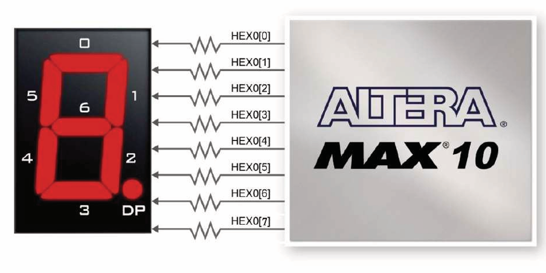
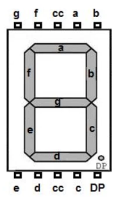
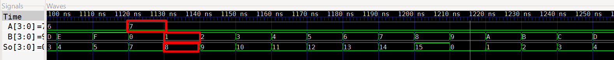
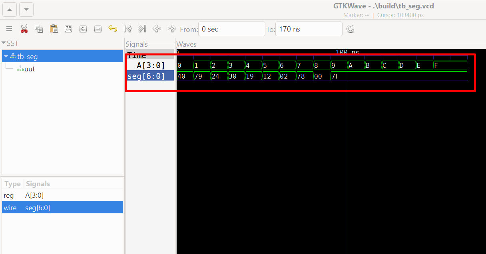
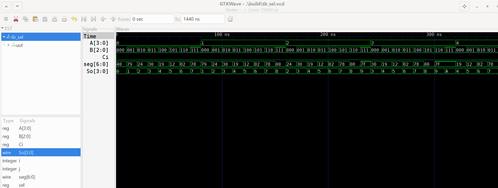

# Lab03 - Decodificador de 4 bit y Display 7 Segmentos

## Integrantes

    * [Cristian Santiago Alfonso Valderrama]
    (https://github.com/CristianAlfonso-ecci) 
    * [Fredi Alexander Melo Prada]
    (https://github.com/Fredi-melo-ecci) 
    * [Fabiam Acevedo]
    (https://github.com/Fabiam-Acevedo-ECCI) 

## Informe

Indice:

1. [Decodificador de 4 Bit y Display 7 Segmentos](#1-Decodificador-de-4-Bit)
2. [Simulaciones](#2-simulaciones)
3. [Implementación en FPGA](#3-implementación-en-fpga)
4. [Resultados](#4-resultados)
5. [Conclusiones](#5-conclusiones)
6. [Referencias](#6-referencias)

## Documentación del diseño implementado

Todos los módulos fueron simulados para verificar su correcto comportamiento lógico y, posteriormente, se sintetizaron e implementaron en una FPGA usando Quartus, comprobando su operación en hardware.

## 1. Decodificador de 4 Bit

### 1.1 Descripción del Decodificador de 4 Bit en Verilog

El decodificador de 4 bits es un circuito combinacional que recibe una entrada binaria de cuatro bits y la traduce a una salida de siete señales, utilizadas para controlar un display de 7 segmentos. En el contexto de la FPGA, este módulo permite determinar qué dígito decimal debe visualizarse en el display a partir del valor binario aplicado en las entradas.

Dependiendo de la combinación de los cuatro bits de entrada, el decodificador identifica el valor numérico correspondiente y activa únicamente los segmentos necesarios para formar dicho dígito. De esta manera, el control del display se realiza de forma sencilla y directa mediante la programación de la FPGA, sin requerir lógica externa adicional.

### 1.2 Un sumador completo de un bit posee tres entradas:

* `A`: primer bit de entrada.
* `B`: segundo bit de entrada.
* `Cin`: acarreo de entrada.

Y dos salidas:

* `S`: resultado de la suma.
* `Cout`: acarreo de salida.

### Tabla de verdad

| A | B | Cin | Cout | S |
| - | - | --- | ---- | - |
| 0 | 0 | 0   | 0    | 0 |
| 0 | 0 | 1   | 0    | 1 |
| 0 | 1 | 0   | 0    | 1 |
| 0 | 1 | 1   | 1    | 0 |
| 1 | 0 | 0   | 0    | 1 |
| 1 | 0 | 1   | 1    | 0 |
| 1 | 1 | 0   | 1    | 0 |
| 1 | 1 | 1   | 1    | 1 |

Las expresiones utilizadas fueron:

    S = Ci ^ ( A ^ B);
    Co = ( B & Ci ) | A & ( B | Ci);

### Con base al sumador de un bit se implemento el sumador de tres bits para que tubuera dos entradas en la FPGA (A) Y (B) y asi poder mostrar el resultado de estas sumas en el display de 7 segmentos.

### 1.3 Funcionamiento del display de 7 segmentos en FPGA (ánodo común)

En una FPGA con display de 7 segmentos de tipo **ánodo común**, todos los ánodos de los LED internos están conectados a un punto común que se enlaza a la alimentación positiva. Para encender un segmento específico, la FPGA debe aplicar un nivel lógico bajo (`0`) en la salida correspondiente, permitiendo así el flujo de corriente a través de dicho segmento.

De esta forma, la lógica de control se invierte respecto a un display de cátodo común: un `0` en la salida de la FPGA enciende el segmento, mientras que un `1` lo mantiene apagado.

El código en Verilog implementa un decodificador que recibe una entrada binaria de 4 bits y, mediante una estructura `case`, asigna a cada valor un patrón de 7 bits para controlar los segmentos del display. Dado que el display es de **ánodo común**, los segmentos se activan con nivel lógico `0` y se apagan con `1`.

---
PINOUT DISPLAY 7 SEGMENTOS FPGA ALTERA 10 MAX





### Evidencias de simulación

Las tablas de verdad fueron verificadas mediante simulación ejecutando GTKWAVE (Verilog) de los respectivos módulos.

---
Codificación en código Verilog:

### Modulo Sumador de 1 bit.
```verilog
module sumador(
    
    input A,
    input B,
    input Ci,

    output So,
    output Co

);

assign So = Ci ^ ( A ^ B);
assign Co = ( B & Ci ) | A & ( B | Ci);

endmodule
```

### Modulo Sumador de 3 bit.
```verilog
`include "sumador.v" // llamada al módulo sumador de un bit

module sum3b (
    input  wire [2:0] A,
    input  wire [2:0] B,
    input  wire       Ci,
    output wire [3:0] So,
    output wire       Co
);
    wire c0, c1;  

    sumador bit0 (
        .A  (A[0]),
        .B  (B[0]),
        .Ci (Ci),
        .So (So[0]),
        .Co (c0)       
    );

    sumador bit1 (
        .A  (A[1]),
        .B  (B[1]),
        .Ci (c0),
        .So (So[1]),
        .Co (c1)      
    );

    sumador bit2 (
        .A  (A[2]),
        .B  (B[2]),
        .Ci (c1),
        .So (So[2]),
        .Co (Co)      
    );

    assign So[3] = Co;

endmodule
```
### Modulo para el display 7 SEGMENTOS (anodo comun)

```verilog

module seg (
    input [3:0] A,
    output reg [6:0] seg
);
    
    always @ (*) begin
        case (A)
            4'b0000: seg = 7'b1000000;
            4'b0001: seg = 7'b1111001;
            4'b0010: seg = 7'b0100100;
            4'b0011: seg = 7'b0110000;
            4'b0100: seg = 7'b0011001;
            4'b0101: seg = 7'b0010010;
            4'b0110: seg = 7'b0000010;
            4'b0111: seg = 7'b1111000;
            4'b1000: seg = ~(7'b1111111);  
            // Para este valor que corresponde al numero 8 se nego la entrada que en sus bit es de 1, a la salida como esta negada muestra 0, es decir, enciende todo el display mostrando el número 8 esperado
            4'b1001: seg = 7'b0010000;
            4'b1010: seg = 7'b0001000;
            4'b1011: seg = 7'b0000011;
            4'b1100: seg = 7'b1000110;
            4'b1101: seg = 7'b0100001;
            4'b1110: seg = 7'b0000110;
            4'b1111: seg = 7'b0001110;
            default: seg = 7'b1111111; // // Apagado para valores no válidos
        endcase
    end
endmodule
            
```
### Modulo Selector (se carga en quartus, encargado de seleccionar)

El módulo `select` se encarga de decidir qué valor se muestra en el display de 7 segmentos: el resultado de la suma o el valor de la entrada `A`, según la posición del interruptor `sel`.

- Si `sel = 0`, se muestra el resultado de la suma (`res`).
- Si `sel = 1`, se muestra directamente el valor de `A`.

El bloque `always @(*)` hace esta selección de forma automática: cada vez que cambia `sel`, `A` o el resultado de la suma, actualiza la salida `So` sin necesidad de un reloj. Finalmente, el módulo envía el valor seleccionado al decodificador de 7 segmentos para que se visualice en el display.

```verilog
`include "sumadorthree.v"
`include "seg.v"

module select (
    input wire [3:0] A,
    input wire [3:0] B,
    input wire Ci,
    input wire sel,
    output wire[6:0] seg,
    output reg [3:0] So
);

    wire [3:0] res;
    sum3b sum (
        .A(A[2:0]),
        .B(B),
        .Ci(Ci),
        .So(res),
        .Co()
    );
    always @(*) begin
        case (sel)
            1'b0: begin
                So = res;
            end
            1'b1: begin
                So = A;
            end
        endcase
    end

    seg segs (
        .A(So),
        .seg(seg)
    );   
endmodule
```

Codificación en código Verilog tb_selector:

```verilog
`timescale 1ns / 1ps
`include "sel.v"

module tb_sel;
    reg [3:0] A;
    reg [2:0] B;
    reg Ci;
    reg sel;

    wire [6:0] seg;
    wire [3:0] So;

    integer i, j;

    select uut (
        .A(A),
        .B(B),
        .Ci(Ci),
        .sel(sel),
        .seg(seg),
        .So(So)
    );

initial begin
    $dumpfile("tb_sel.vcd");
    $dumpvars(0,tb_sel);

    for(i=0; i<16; i=i+1) begin
        for(j=0; j<8; j=j+1) begin
            A=i;
            B=j;
            Ci=0;
            sel=0;
            #10;
        end
    end
    for(i=0; i<16; i=i+1) begin
            A=i;
            Ci=0;
            sel=1;
            #10;
    end
end
endmodule
```

---

## 2. Simulaciones

Antes de llevar a cabo la implementación física, el diseño se sometió a un proceso de simulación por GTKWAVE con el fin de verificar el comportamiento lógico del circuito.

### Resultados esperados en la simulación

En la simulación se observarán dos etapas claramente diferenciadas según el valor de `sel`:

- **Primera etapa (`sel = 0`):** se recorren todas las combinaciones de `A` (0–15) y `B` (0–7), con `Ci = 0`. En cada paso, el módulo `select` toma el resultado de la suma (`res`) y lo envía al display. Por lo tanto, se observará cómo cambian `So` y `seg`, reflejando el resultado de la suma para cada combinación.

- **Segunda etapa (`sel = 1`):** se recorren los valores de `A` (0–15), manteniendo `Ci = 0` y `sel = 1`. Aquí el módulo ignora la suma y envía directamente el valor de `A` al display. En la simulación se verá que `So` coincide exactamente con `A`, y `seg` cambia acorde al dígito decimal correspondiente.

En resumen, la simulación permitirá verificar que el selector funciona correctamente: con `sel = 0` muestra la suma, y con `sel = 1` muestra el valor de `A`.

---
Sumador


Salida del display 7 Segmentos (Decodificador)


Salida del modulo (Selector) en donde se implmenta los demas modulos anteriormente mencionados.



## 3. Implementación en FPGA

Tras validar los diseños mediante simulación, los circuitos se implementaron en una tarjeta FPGA empleando el entorno de desarrollo Quartus. Para la asignación correcta de pines, se consultó el manual de la placa con FPGA Altera MAX 10 (10M50DAF484C7G), configurando los switches como entradas (señales A, B y C) y los LEDs como salidas.

Esta implementación en hardware permitió verificar físicamente el correcto funcionamiento de las compuertas lógicas, del detector de números primos y del sumador.

### Evidencias de implementación

En esta sección se incorporan las evidencias obtenidas durante la implementación y demostración del funcionamiento de los circuitos en FPGA.

[Ver implementación de decodificador en FPGA con salida en display de 7 segmentos](https://youtube.com/shorts/4XhQkAXjQDo?feature=share)

---

## 4. Resultados

La simulación del diseño permitió verificar el correcto funcionamiento del decodificador de 4 bits y el módulo selector. Durante la ejecución del testbench, se observó que el display de 7 segmentos mostraba los dígitos esperados según el valor aplicado en las entradas y la posición del interruptor `sel`.

Cuando `sel = 0`, el display mostró el resultado de la suma de `A` y `B`, confirmando que el módulo `select` estaba enviando correctamente el valor de `res` al decodificador. Por otro lado, cuando `sel = 1`, el display mostró directamente el valor de `A`, evidenciando que el selector estaba cambiando la fuente de datos según lo esperado.

La implementación en la FPGA corroboró los resultados obtenidos en simulación. Al manipular los interruptores correspondientes a las entradas `A`, `B` y `sel`, se pudo observar en tiempo real cómo el display actualizaba el dígito mostrado, validando así el comportamiento del circuito tanto en entorno de simulación como en hardware.

---

## 5. Conclusiones

- La simulación permitió validar el comportamiento lógico del circuito antes de proceder con su implementación física en hardware.
- Se implementó un sumador de 4 bits a partir de cuatro módulos sumadores de 1 bit interconectados mediante una cadena de acarreo.
- La instanciación de módulos posibilitó reutilizar el diseño previamente desarrollado, facilitando la construcción de un sistema digital de mayor complejidad.
- Mediante el uso de Quartus, el diseño en HDL se sintetizó y se cargó en la FPGA, lo que permitió comprobar experimentalmente su correcto funcionamiento.
- La configuración de los interruptores como entradas y de los LED como salidas posibilitó visualizar de forma directa los resultados de las operaciones efectuadas por el sumador.
- Con base en la disposición de los LED en la FPGA, se reforzó la interpretación de los pesos binarios (2⁰, 2¹, 2², 2³), lo que permitió relacionar correctamente los bits de entrada de A y B con el resultado esperado de la suma.

---

## 6. Referencias

* Material de clase de la asignatura Técnicas Digitales, Universidad ECCI.
* Documentación y material proporcionado para el Laboratorio 02: sumador 4bit.
* IEEE Standard for Verilog Hardware Description Language.
* Manual de usuario DE10-Lite Cost-effective Max 10 board
